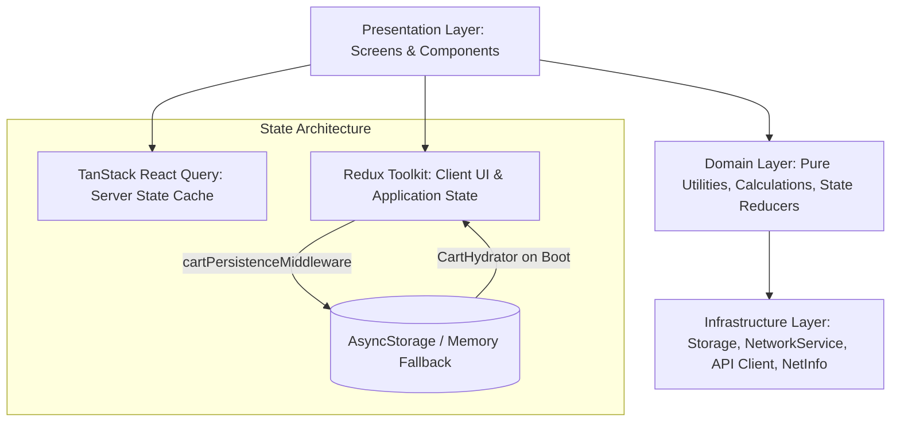
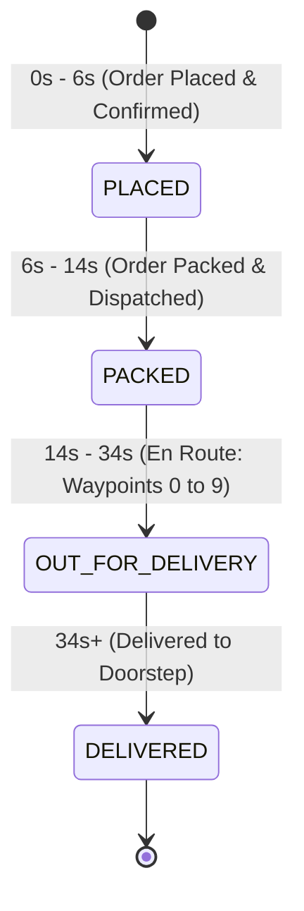

# GigaBox — Technical Architecture & Project Documentation

> **Version:** 1.0.0  
> **Platform:** React Native (Android / iOS)  
> **Runtime Environment:** React Native 0.87.1 · React 19.2.3 · TypeScript 5.8 · Hermes Engine  

---

## Table of Contents
1. [Executive Summary & Tech Stack](#1-executive-summary--tech-stack)
2. [High-Level System Architecture](#2-high-level-system-architecture)
3. [Complete Project Folder & File Structure](#3-complete-project-folder--file-structure)
4. [State Management & Data Flow Architecture](#4-state-management--data-flow-architecture)
5. [Feature Breakdown & Functionalities](#5-feature-breakdown--functionalities)
   - [5.1 Product Catalog (`features/catalog`)](#51-product-catalog-featurescatalog)
   - [5.2 Cart & Local Persistence (`features/cart`)](#52-cart--local-persistence-featurescart)
   - [5.3 Checkout & Validation (`features/checkout`)](#53-checkout--validation-featurescheckout)
   - [5.4 Live Order Tracking & State Machine (`features/order`)](#54-live-order-tracking--state-machine-featuresorder)
   - [5.5 Offline Resilience & Network Error System (`features/network`)](#55-offline-resilience--network-error-system-featuresnetwork)
6. [Design System, Theming & Responsiveness](#6-design-system-theming--responsiveness)
7. [Performance & Build Optimization Techniques](#7-performance--build-optimization-techniques)
   - [7.1 Android Native & APK Size Reduction (86% Reduction)](#71-android-native--apk-size-reduction-86-reduction)
   - [7.2 JavaScript & Runtime Performance](#72-javascript--runtime-performance)
   - [7.3 Animation & Rendering Optimizations](#73-animation--rendering-optimizations)
8. [Testing, Quality Assurance & Reliability](#8-testing-quality-assurance--reliability)
9. [Developer Guide & Build Operations](#9-developer-guide--build-operations)
10. [Troubleshooting & Common Pitfalls](#10-troubleshooting--common-pitfalls)

---

## 1. Executive Summary & Tech Stack

**GigaBox** is an e-commerce mobile application engineered for high rendering performance, deterministic offline resilience, and minimal binary footprint on resource-constrained mobile devices. 

The application implements a full-funnel shopping workflow: browsing paginated catalogs with debounced search, granular category filtering, optimistic cart management with cold-launch persistence, validation-backed multi-step checkout, and interactive GPS order tracking with a deterministic state machine and native thread interpolation.

### Core Technology Stack

| Layer | Technology | Version | Purpose & Rationale |
| :--- | :--- | :--- | :--- |
| **Mobile Core** | React Native | 0.87.1 | Core native bridge with TurboModules & Fabric capabilities. |
| **Language** | TypeScript | 5.8.3 | Strict end-to-end type safety, eliminating runtime null/undefined traps. |
| **JS Engine** | Hermes | Built-in | Ahead-of-time (AOT) bytecode compilation, fast TTI, lower memory footprint. |
| **Server State** | TanStack React Query | 5.66.0 | Server cache, background revalidation, query pausing when offline. |
| **Client State** | Redux Toolkit | 2.5.1 | Centralized application state (Cart, Checkout, Order Tracking). |
| **Navigation** | React Navigation (Native Stack) | 7.0.14 | Hardware-accelerated native screen transitions. |
| **Network Client** | Axios | 1.7.9 | Centralized HTTP interceptors, timeouts, and categorized error mapping. |
| **Connectivity** | NetInfo | 11.4.1 | Native device network reachability detection. |
| **Local Storage** | AsyncStorage | 2.1.2 | Key-value disk persistence with defensive in-memory fallback. |
| **Maps & GPS** | React Native Maps | 1.18.0 | Native MapView rendering with `AnimatedRegion` coordinate interpolation. |
| **Logging** | React Native Logs | 5.3.3 | Configurable log severity transports for debugging and production telemetry. |
| **Unit Testing** | Jest + React Test Renderer | 29.6.3 | Unit, regression, and snapshot test coverage for logic and components. |

---

## 2. High-Level System Architecture

GigaBox adopts **Clean Layered Architecture** with **Feature-First Domain Organization**. Each architectural layer depends only inward toward pure abstractions, isolating domain business logic from framework and platform concerns.



### Architectural Tenets
1. **Unidirectional Data Flow**: User interactions dispatch actions to Redux slices or trigger React Query mutations. State changes propagate downward via memoized selectors.
2. **Strict State Partitioning**: Server state (product items, categories) is exclusively managed by TanStack Query. Redux owns only client-managed data (cart items, checkout fields, order status). No server payloads are cloned into Redux.
3. **Decoupled Business Rules**: Currency formatting, sales tax, shipping fee tiers, delivery validation, and tracking transitions live in pure TypeScript functions with zero UI or React dependencies, guaranteeing 100% testability.
4. **Resilience by Default**: All network and storage operations employ defensive fallbacks (e.g., in-memory key-value maps when native AsyncStorage fails; offline query pausing when device connectivity drops).

---

## 3. Complete Project Folder & File Structure

```text
GigaBoxApp/
├── .nvmrc                               # Pinned Node.js version (20)
├── App.tsx                              # Application entry point with providers
├── babel.config.js                      # Babel configuration for React Native
├── index.js                             # React Native root app registry
├── jest.config.js                       # Jest test runner configuration
├── jest.setup.js                        # Global Jest mocks (AsyncStorage, NetInfo, Reanimated)
├── metro.config.js                      # Metro bundler config (inlineRequires enabled)
├── package.json                         # Project dependencies and script commands
├── tsconfig.json                        # TypeScript compiler options (moduleResolution: bundler)
├── PERFORMANCE.md                       # Performance & offline optimization benchmark report
├── PROJECT_DOCUMENTATION.md             # Complete system documentation (this document)
│
├── __tests__/                           # Automated Jest test suites
│   ├── App.test.tsx                     # Top-level smoke and provider integration test
│   ├── NetworkErrorScreen.test.tsx      # Network error UI & retry callback tests
│   ├── cartPersistence.test.ts          # Storage serialization & hydration integration tests
│   ├── network.test.ts                  # Centralized NetworkService connectivity tests
│   ├── trackingStateMachine.test.ts     # Order tracking deterministic transition tests
│   └── utils.test.ts                    # Pure business logic unit tests (pricing, currency, validation)
│
├── android/                             # Android native build configuration
│   ├── app/
│   │   ├── build.gradle                 # Module build config: ABI splits, R8 minification, resConfigs
│   │   └── proguard-rules.pro           # Keep rules for React Native, Hermes, Maps, Screens, NetInfo
│   └── gradle.properties                # Build flags: reactNativeArchitectures, hermesEnabled, JVM args
│
└── src/                                 # Application Source Code
    ├── app/                             # Core Application Setup
    │   ├── navigation/
    │   │   ├── AppNavigator.tsx         # Native stack navigator registering all application routes
    │   │   ├── RootNavigator.tsx        # Top-level NavigationContainer with theme integration
    │   │   └── navigationTypes.ts       # Typed route param lists & ScreenProps definitions
    │   └── providers/
    │       └── AppProviders.tsx         # Nested provider tree (Redux, Query, Network, Theme, SafeArea)
    │
    ├── components/common/               # Shared Reusable Presentational Components
    │   ├── AppButton.tsx                # Accessible, styled primary/secondary/outline CTA button
    │   ├── AppIcon.tsx                  # Lightweight, resolution-independent vector glyph system
    │   ├── AppModal.tsx                 # Accessible dialog modal with background dimming
    │   ├── EmptyView.tsx                # Configurable empty state placeholder with action button
    │   ├── ErrorView.tsx                # Error banner/view with retry action trigger
    │   ├── LoadingView.tsx              # Centered activity indicator with contextual messaging
    │   ├── OfflineBanner.tsx            # Animated 60 FPS slide-in banner for connection drop warnings
    │   ├── OptimizedList.tsx            # FlatList wrapper configured for high-performance memory usage
    │   ├── QuantityStepper.tsx          # Increment/decrement stepper with minimum floor safeguards
    │   ├── ScreenContainer.tsx          # Safe-area aware screen wrapper with status bar management
    │   └── index.ts                     # Barrel exports for common components
    │
    ├── features/                        # Domain Features (Feature-Sliced Design)
    │   ├── cart/                        # Shopping Cart Feature
    │   │   ├── components/
    │   │   │   ├── CartHydrator.tsx     # Startup component restoring persisted items from storage
    │   │   │   └── CartItem.tsx         # Memoized individual cart row with quantity controls
    │   │   ├── screens/
    │   │   │   └── CartScreen.tsx       # Cart screen showing line items, order summary, and checkout CTA
    │   │   ├── store/
    │   │   │   ├── cartSelectors.ts     # Derived memoized selectors (subtotal, count, tax, total)
    │   │   │   ├── cartSlice.ts         # Redux reducer for add, remove, updateQuantity, and clearCart
    │   │   │   └── cartTypes.ts         # TypeScript definitions for cart items and action payloads
    │   │   └── types.ts                 # Cart domain models
    │   │
    │   ├── catalog/                     # Product Catalog Feature
    │   │   ├── components/
    │   │   │   ├── CategoryChip.tsx     # Filter chip component for category selection
    │   │   │   ├── ProductCard.tsx      # Memoized grid card showing thumbnail, title, price, discount
    │   │   │   ├── ProductGrid.tsx      # Optimized 2-column grid rendering product cards
    │   │   │   └── SearchBar.tsx        # Text input with clear button and debounced event dispatch
    │   │   ├── data/
    │   │   │   └── mockProducts.ts      # Offline fallback fixtures for development/testing
    │   │   ├── hooks/
    │   │   │   └── useProducts.ts       # TanStack Query hook managing infinite paginated data fetching
    │   │   ├── screens/
    │   │   │   ├── CatalogScreen.tsx    # Main product feed with search, category bar, and cart badge
    │   │   │   └── ProductDetailsScreen.tsx # Detailed view with gallery, specs, ratings, and add to cart
    │   │   ├── services/
    │   │   │   └── productRepository.ts # Data layer orchestrating API calls and error transformations
    │   │   └── types.ts                 # Product, Category, and API response contracts
    │   │
    │   ├── checkout/                    # Checkout & Order Placement Feature
    │   │   ├── screens/
    │   │   │   └── CheckoutScreen.tsx   # Multi-section screen: shipping, payment, order summary
    │   │   └── store/
    │   │       ├── checkoutSelectors.ts # Selectors for address, payment method, placement status
    │   │       ├── checkoutSlice.ts     # Redux slice for checkout form inputs and order state
    │   │       └── checkoutTypes.ts     # Address, payment, and order submission types
    │   │
    │   ├── network/                     # Network Error Screen Feature
    │   │   ├── screens/
    │   │   │   ├── NetworkErrorScreen.tsx # Fullscreen offline UI with radar pulse & diagnostics
    │   │   │   └── index.ts
    │   │   └── index.ts
    │   │
    │   └── order/                       # Live Order Tracking Feature
    │       ├── components/
    │       │   ├── CourierMarker.tsx    # Native animated map marker representing courier location
    │       │   ├── OrderStatus.tsx      # Visual status pill showing ETA and current milestone
    │       │   ├── OrderTrackingMap.tsx # Google/Apple Maps integration with route polyline
    │       │   └── TrackingTimeline.tsx # Vertical step indicator reflecting state machine progress
    │       ├── hooks/
    │       │   └── useOrderTracking.ts  # Hook binding tracking telemetry provider to Redux state
    │       ├── screens/
    │       │   └── TrackingScreen.tsx   # Live tracking screen with lazy-loaded map and delivery actions
    │       ├── store/
    │       │   ├── orderSelectors.ts    # Selectors for order ID, tracking status, and coordinates
    │       │   └── orderSlice.ts        # Redux slice storing active order progress and routeIndex
    │       └── utils/
    │           └── trackingFormatters.ts# Pure helper functions for titles, ETA strings, and steps
    │
    ├── hooks/                           # Global Application Hooks
    │   ├── useAppState.ts               # Tracks foreground/background transitions for sync
    │   └── useDebounce.ts               # Debounces values to throttle rapid UI inputs (e.g. search)
    │
    ├── services/                        # Infrastructure & External Services
    │   ├── api/
    │   │   ├── apiClient.ts             # Configured Axios instance with interceptors and timeouts
    │   │   ├── apiError.ts              # Normalized ApiError class with typed categories
    │   │   ├── endpoints.ts             # Centralized API URI dictionary
    │   │   ├── errorHandler.ts          # Normalizer mapping HTTP/network errors to ApiError
    │   │   └── index.ts
    │   ├── logger/                      # Centralized Logging Service
    │   │   ├── index.ts
    │   │   └── logger.ts                # Structured logger (debug, info, warn, error)
    │   ├── network/                     # Network Connectivity Service
    │   │   ├── NetworkContext.tsx       # React Context exposing isOnline and checkConnectivity()
    │   │   ├── NetworkService.ts        # Singleton coordinating NetInfo and React Query onlineManager
    │   │   └── index.ts
    │   ├── query/                       # TanStack React Query Client Configuration
    │   │   ├── index.ts
    │   │   └── queryClient.ts           # Configured QueryClient (staleTime: 5m, gcTime: 15m, networkMode: online)
    │   ├── storage/                     # Persistent Key-Value Storage
    │   │   ├── index.ts
    │   │   └── storage.ts               # StorageService wrapping AsyncStorage with in-memory fallback
    │   └── tracking/                    # Order Simulation Telemetry Provider
    │       ├── index.ts
    │       ├── mockTrackingProvider.ts  # Deterministic telemetry emitter running on a 2.5s cadence
    │       ├── trackingProvider.ts      # Abstract interface for order tracking providers
    │       ├── trackingStateMachine.ts  # Pure state transition rules and milestone calculations
    │       └── trackingTypes.ts         # Coordinates, milestones, routes, and timeline constants
    │
    ├── store/                           # Global Redux Store Configuration
    │   ├── hooks.ts                     # Type-safe useAppDispatch and useAppSelector hooks
    │   ├── index.ts                     # Store exports
    │   ├── rootReducer.ts               # Root reducer combining cart, checkout, and order slices
    │   └── store.ts                     # Redux store with persistence middleware and CART_STORAGE_KEY
    │
    ├── theme/                           # Design System & Styling
    │   ├── ThemeContext.tsx             # Context provider managing active theme and dark/light toggling
    │   ├── colors.ts                    # Curated color tokens (Primary Blue #0466c8, Soft Whites)
    │   ├── shadows.ts                   # Platform-neutral elevation and shadow definitions
    │   ├── spacing.ts                   # 4px modular spacing scale and border radii
    │   ├── typography.ts                # Typographic scale, line heights, and font weights
    │   └── index.ts
    │
    └── utils/                           # Pure Domain Business Utilities
        ├── currency.ts                  # Currency formatting and percentage discount calculations
        ├── index.ts
        ├── pricing.ts                   # Pure financial arithmetic (subtotal, shipping tier, tax, total)
        ├── responsive.ts                # Density and dimension-aware scaling engine (scale, verticalScale)
        └── validation.ts                # Pure validation rules for checkout shipping addresses
```

---

## 4. State Management & Data Flow Architecture

To eliminate state synchronization bugs and redundant memory consumption, GigaBox enforces strict categorization across five types of state:

```text
┌──────────────────────────────────────────────────────────────────────────────┐
│                            STATE CLASSIFICATION                              │
├────────────────────────┬─────────────────────────────────────────────────────┤
│ 1. Server State        │ Owned exclusively by TanStack React Query           │
│                        │ (Product catalog, category items, search results)   │
├────────────────────────┼─────────────────────────────────────────────────────┤
│ 2. Shared Client State │ Owned exclusively by Redux Toolkit                  │
│                        │ (Cart items, active checkout form, order tracking)  │
├────────────────────────┼─────────────────────────────────────────────────────┤
│ 3. Local UI State      │ Managed via React useState                          │
│                        │ (Search input text, modal visibility, active tab)   │
├────────────────────────┼─────────────────────────────────────────────────────┤
│ 4. Non-UI Mutable Refs │ Managed via React useRef                            │
│                        │ (Debounce timers, pagination locks, interval IDs)   │
├────────────────────────┼─────────────────────────────────────────────────────┤
│ 5. Derived State       │ Computed on-the-fly via pure memoized selectors     │
│                        │ (Subtotal, sales tax, shipping fee, item counts)    │
└────────────────────────┴─────────────────────────────────────────────────────┘
```

### The Redux Persistence Pipeline
Cart persistence is handled automatically via a custom Redux middleware (`cartPersistenceMiddleware` in [`src/store/store.ts`](file:///Users/nikhilgupta/Desktop/GigaBoxAssignment/GigaBoxApp/src/store/store.ts)):

1. Every time a Redux action prefixed with `cart/` is dispatched (excluding hydration itself), the middleware intercepts the action.
2. It evaluates the updated `state.cart.items` array.
3. It asynchronously writes the serialized array to disk under `@gigabox_cart_items` using [`StorageService`](file:///Users/nikhilgupta/Desktop/GigaBoxAssignment/GigaBoxApp/src/services/storage/storage.ts).
4. On cold boot, [`CartHydrator`](file:///Users/nikhilgupta/Desktop/GigaBoxAssignment/GigaBoxApp/src/features/cart/components/CartHydrator.tsx) retrieves the stored items and dispatches `setCartItems(persistedItems)`, restoring user state before UI rendering finishes.

---

## 5. Feature Breakdown & Functionalities

### 5.1 Product Catalog (`features/catalog`)
The catalog feed is the primary user landing experience:
- **Infinite Pagination**: Powered by [`useInfiniteProducts`](file:///Users/nikhilgupta/Desktop/GigaBoxAssignment/GigaBoxApp/src/features/catalog/hooks/useProducts.ts). Fetches products in batches of 10 (`limit=10, skip=pageParam * 10`). An `isPaginatingRef` lock guards `onEndReached` from triggering duplicate concurrent fetches during rapid inertia scrolling.
- **Debounced Instant Search**: Users type into [`SearchBar`](file:///Users/nikhilgupta/Desktop/GigaBoxAssignment/GigaBoxApp/src/features/catalog/components/SearchBar.tsx). The input updates local text immediately for responsive typing, while [`useDebounce`](file:///Users/nikhilgupta/Desktop/GigaBoxAssignment/GigaBoxApp/src/hooks/useDebounce.ts) waits 350ms before switching the active query parameter, avoiding unnecessary network traffic.
- **Category Filter Chips**: A horizontal bar displays category chips. Tapping a category invalidates the active feed and switches the API endpoint from `/products` to `/products/category/{category}`.
- **Product Details Screen**: Displays full-resolution image galleries, product specifications, customer rating stars, stock availability badges, and sticky bottom CTAs for immediate cart addition.

### 5.2 Cart & Local Persistence (`features/cart`)
- **Granular Cart Actions**: Supports `addToCart`, `removeFromCart`, `updateQuantity`, and `clearCart`.
- **Quantity Stepper**: Implements [`QuantityStepper`](file:///Users/nikhilgupta/Desktop/GigaBoxAssignment/GigaBoxApp/src/components/common/QuantityStepper.tsx) with a strict minimum floor. Decrementing below 1 triggers a deletion confirmation or immediately removes the line item depending on context.
- **Header Badge Sync**: A live badge in the navigation header displays total quantity (`selectCartItemCount`). Because it selects a scalar primitive, header components only re-render when the total count changes.

### 5.3 Checkout & Validation (`features/checkout`)
- **Shipping Address Validation**: Pure validation functions in [`src/utils/validation.ts`](file:///Users/nikhilgupta/Desktop/GigaBoxAssignment/GigaBoxApp/src/utils/validation.ts) check:
  - Full Name (minimum 2 characters, non-empty)
  - Street Address (minimum 5 characters)
  - City (valid alphabetic string)
  - ZIP Code (exact 5-digit US format)
  - Phone Number (valid 10-digit format)
- **Payment Method Selection**: Allows switching between `Cash on Delivery (COD)`, `Credit/Debit Card`, and `Digital Wallet`.
- **Deterministic Pricing Breakdown**: Computed via [`src/utils/pricing.ts`](file:///Users/nikhilgupta/Desktop/GigaBoxAssignment/GigaBoxApp/src/utils/pricing.ts):
  - **Subtotal**: Sum of `(item.price * item.quantity)`
  - **Delivery Fee**: Free ($0) for orders $\ge \$300$; otherwise a flat $\$15.00$
  - **Estimated Tax**: Fixed 8% sales tax calculation
  - **Total**: `subtotal + deliveryFee + tax`
- **Order Placement**: Tapping "Place Order" clears the cart, initializes an order record in the Redux `order` slice with an autogenerated ID (e.g. `GB-89412`), and seamlessly transitions the user to the Live Tracking Screen.

### 5.4 Live Order Tracking & State Machine (`features/order`)
Live tracking visualizes delivery progress using a deterministic time-based state machine:



- **Milestone Thresholds**:
  - `0s - 6s`: **`PLACED`** — Order received at fulfillment center.
  - `6s - 14s`: **`PACKED`** — Order packed and handed to courier.
  - `14s - 34s`: **`OUT_FOR_DELIVERY`** — Courier travels along a 10-waypoint route through San Francisco's Market & Mission corridor.
  - `34s+`: **`DELIVERED`** — Order marked complete.
- **Telemetry Provider (`MockTrackingProvider`)**: Emits updates every 2.5 seconds (`TRACKING_TICK_INTERVAL`). The courier coordinates and status are derived from `Date.now() - startedAt`. This guarantees that if the app is backgrounded or killed, reopening the app immediately reflects the correct milestone and position without clock drift.
- **Native Marker Interpolation**: [`CourierMarker.tsx`](file:///Users/nikhilgupta/Desktop/GigaBoxAssignment/GigaBoxApp/src/features/order/components/CourierMarker.tsx) uses `react-native-maps` `AnimatedRegion`. Coordinate movement is calculated on the native thread, avoiding JS thread frame drops.
- **`tracksViewChanges={false}`**: Once rendered, marker rasterization is frozen, preventing GPU redraws on every single frame on Android.
- **Code Splitting via `React.lazy`**: The native MapView ([`OrderTrackingMap.tsx`](file:///Users/nikhilgupta/Desktop/GigaBoxAssignment/GigaBoxApp/src/features/order/components/OrderTrackingMap.tsx)) is lazy-loaded with a [`MapSkeleton`](file:///Users/nikhilgupta/Desktop/GigaBoxAssignment/GigaBoxApp/src/features/order/screens/TrackingScreen.tsx#L25) fallback, ensuring instant screen transition without waiting for native OpenGL shader initialization.

### 5.5 Offline Resilience & Network Error System (`features/network`)
- **Centralized Singleton (`NetworkService`)**: Subscribes to `@react-native-community/netinfo` in a single place. Broadcasts connectivity status to TanStack Query's `onlineManager` and React context.
- **Auto-Pausing & Resumption**: TanStack Query is configured with `networkMode: 'online'`. When the device loses internet, pending queries pause without failing or triggering retry loops. Upon reconnection, queries resume and refresh active views automatically.
- **Full-Screen Network Error Screen (`NetworkErrorScreen.tsx`)**: When offline, users can be routed to a dedicated screen featuring:
  - Concentric radar pulse animations running at 60 FPS on the native thread (`useNativeDriver: true`).
  - Diagnostic troubleshooting cards (Wi-Fi/Cellular, Airplane Mode, Router).
  - An interactive "Try Again" CTA that explicitly re-checks hardware network connectivity via `NetworkService.checkConnectivity()`.

---

## 6. Design System, Theming & Responsiveness

### Color Palette Architecture (`src/theme/colors.ts`)
The color system emphasizes high-contrast accessibility and reduced visual fatigue:
- **Primary Brand Blue (`#0466c8`)**: Used for primary action buttons, focused controls, and active indicators.
- **App Canvas Background (`#f8f9fa`)**: Clean, soft off-white canvas that eliminates harsh glare compared to pure white (`#ffffff`).
- **Elevated Card Surface (`#fcfafb`)**: Subtle contrast layer for product cards, bottom sheets, and modals.
- **Semantic Accents**:
  - Success: `#2ec4b6` (In-stock badges, delivered status)
  - Warning: `#ff9f1c` (Low-stock badges, preparing status)
  - Error: `#e63946` (Form errors, connection drop warnings)

### Responsive Scaling System (`src/utils/responsive.ts`)
The app automatically adapts across phone screens, small compact devices, and tablets based on a base design canvas of **375 × 812 pt**:
- `scale(size)`: Scales widths, horizontal paddings, and horizontal margins relative to screen width.
- `verticalScale(size)`: Scales heights and vertical spacings relative to screen height.
- `moderateScale(size, factor = 0.5)`: Selectively dampens scaling for font sizes and border radii so text remains readable without expanding disproportionately on tablets.
- `isTablet()` & `isSmallDevice()`: Helper flags for responsive column arrangements (e.g. 2-column grid on phones vs. 3-column grid on tablets).

### Resolution-Independent Vector Icons (`AppIcon.tsx`)
Replaces multiple sets of `@2x` and `@3x` PNG assets with lightweight vector glyphs for:
`'search'`, `'cart'`, `'back'`, `'plus'`, `'minus'`, `'delete'`, `'location'`, `'retry'`, `'offline'`, `'success'`, `'error'`.

---

## 7. Performance & Build Optimization Techniques

### 7.1 Android Native & APK Size Reduction (86% Reduction)

By applying direct distribution optimizations, the Android release build was reduced from **71 MB** down to **10 MB**:

| Optimization Step | Implementation | Effect on Build |
| :--- | :--- | :--- |
| **ABI Splitting** | `splits { abi { enable true; universalApk false; include "armeabi-v7a", "arm64-v8a" } }` in [`build.gradle`](file:///Users/nikhilgupta/Desktop/GigaBoxAssignment/GigaBoxApp/android/app/build.gradle) | Generates per-architecture APKs rather than bundling all CPU binaries into one fat APK. |
| **Architecture Targeting** | `reactNativeArchitectures=armeabi-v7a,arm64-v8a` in [`gradle.properties`](file:///Users/nikhilgupta/Desktop/GigaBoxAssignment/GigaBoxApp/android/gradle.properties) | Skips compiling emulator architectures (`x86`, `x86_64`), cutting native C++ compile time. |
| **R8 / ProGuard Minification** | `minifyEnabled true` in [`build.gradle`](file:///Users/nikhilgupta/Desktop/GigaBoxAssignment/GigaBoxApp/android/app/build.gradle) | Strips unused Java/Kotlin classes and methods, optimizing bytecode across all libraries. |
| **Resource Shrinking** | `shrinkResources true` in [`build.gradle`](file:///Users/nikhilgupta/Desktop/GigaBoxAssignment/GigaBoxApp/android/app/build.gradle) | Removes unused XML layouts, drawables, and assets stripped by R8. |
| **JNI Lib Compression** | `packaging { jniLibs { useLegacyPackaging = true } }` | Compresses `.so` shared libraries inside the final APK package. |
| **Language Resource Stripping** | `resConfigs "en"` in `defaultConfig` | Drops translation strings for non-supported languages from third-party libraries. |
| **Hermes Engine** | `hermesEnabled=true` in [`gradle.properties`](file:///Users/nikhilgupta/Desktop/GigaBoxAssignment/GigaBoxApp/android/gradle.properties) | Compiles JS into optimized Hermes bytecode during the Gradle build step. |

#### Resulting Artifacts
- **Modern 64-bit devices (`arm64-v8a`)**: **10 MB** ([`app-arm64-v8a-release.apk`](file:///Users/nikhilgupta/Desktop/GigaBoxAssignment/GigaBoxApp/android/app/build/outputs/apk/release/app-arm64-v8a-release.apk))
- **Legacy 32-bit devices (`armeabi-v7a`)**: **9.5 MB** ([`app-armeabi-v7a-release.apk`](file:///Users/nikhilgupta/Desktop/GigaBoxAssignment/GigaBoxApp/android/app/build/outputs/apk/release/app-armeabi-v7a-release.apk))

### 7.2 JavaScript & Runtime Performance
- **Optimized FlatLists (`OptimizedList.tsx`)**:
  - `removeClippedSubviews={true}`: Unbinds off-screen native views on Android to conserve GPU memory.
  - `initialNumToRender={6}`: Mounts only visible viewport items on first paint.
  - `maxToRenderPerBatch={8}` & `windowSize={5}`: Restricts off-screen buffer allocations to prevent Out-Of-Memory (OOM) crashes on 2GB/3GB RAM Android devices.
  - `keyExtractor={(item) => String(item.id)}`: Ensures stable keys and avoids index-based re-renders.
- **Selective Value-Based Memoization**:
  - `ProductCard` wrapped in `React.memo` to prevent re-rendering when sibling items change.
  - `CartItem` wrapped in `React.memo` with a custom equality function comparing only `productId`, `quantity`, `price`, and `title`. Incrementing item A will never re-render item B.
- **`useState` vs `useRef` Decoupling**:
  - Non-rendering operational variables (e.g. `isPaginatingRef`, `debounceTimerRef`, `placeOrderTimerRef`, `cartItemsRef`) use `useRef` to avoid triggering re-render cycles.
- **Metro Inline Requires**:
  - Added `inlineRequires: true` in [`metro.config.js`](file:///Users/nikhilgupta/Desktop/GigaBoxAssignment/GigaBoxApp/metro.config.js), deferring module execution until first use to accelerate cold application startup.

### 7.3 Animation & Rendering Optimizations
- **Native Driver Execution**: All status animations, banner slide-ins, and radar pulses configure `useNativeDriver: true`. This offloads frame ticks to the Android UI thread, guaranteeing smooth 60 FPS movement even if the JavaScript thread is busy parsing JSON.
- **Explicit Image Dimensions**: Every image has predefined width, height, and background placeholders to eliminate Cumulative Layout Shift (CLS) as remote images load.

---

## 8. Testing, Quality Assurance & Reliability

The codebase features comprehensive automated test coverage spanning unit, integration, and UI component tests:

```text
 PASS  __tests__/utils.test.ts (Pricing, Currency, Validation, Tracking formatters)
 PASS  __tests__/trackingStateMachine.test.ts (State transitions & time calculations)
 PASS  __tests__/network.test.ts (NetworkService singleton & offline error classification)
 PASS  __tests__/cartPersistence.test.ts (AsyncStorage serialization & hydration)
 PASS  __tests__/NetworkErrorScreen.test.tsx (Radar animation & retry callback trigger)
 PASS  __tests__/App.test.tsx (Smoke test: Provider hierarchy & initial render)

Test Suites: 6 passed, 6 total
Tests:       33 passed, 33 total
Snapshots:   0 total
```

### Static Analysis & Verification Commands
- **TypeScript Type Checking**:
  ```bash
  npx tsc --noEmit
  ```
  *(Passes with 0 errors across all 70+ source files).*
- **Unit & Integration Test Suite**:
  ```bash
  npm test
  ```
- **Lint Verification**:
  ```bash
  npm run lint
  ```

---

## 9. Developer Guide & Build Operations

### Prerequisites
- **Node.js**: `v20.x` (managed via `.nvmrc`)
- **Package Manager**: `npm` v10+
- **JDK**: Java 17 (required for React Native 0.87 & Android Gradle Plugin)
- **Android SDK**: Build tools 35.0.0, compileSdk 35, NDK 27.1.12297006

### Development Workflow

```bash
# 1. Ensure Node 20 is active in your terminal session
nvm use 20

# 2. Install dependencies (if newly cloned)
npm install

# 3. Start Metro bundler with cache reset
npm start -- --reset-cache

# 4. In a separate terminal, launch on an Android emulator or connected device
npm run android
```

### Production Release Build

To generate the optimized release APKs:

```bash
# Navigate to the Android project directory
cd android

# Ensure any previous Gradle daemon is stopped
./gradlew --stop

# Build the release APKs
./gradlew assembleRelease
```

Generated APKs will be output to:
`android/app/build/outputs/apk/release/`
- `app-arm64-v8a-release.apk`
- `app-armeabi-v7a-release.apk`

---

## 10. Troubleshooting & Common Pitfalls

### 1. `Execution failed for task ':app:generateAutolinkingPackageList'`
- **Cause**: Node.js was set to version < 18 in the terminal session running Gradle. The React Native CLI failed to run and produced an empty `autolinking.json` (0 bytes).
- **Resolution**:
  ```bash
  nvm use 20
  cd android
  ./gradlew --stop
  rm -rf build/generated/autolinking
  ./gradlew assembleRelease
  ```

### 2. `Cannot find module ... or its corresponding type declarations` in IDE
- **Cause**: The IDE's in-memory TypeScript language service cached file paths before newly created `index.ts` files were indexed, or ambiguous folder imports were used.
- **Resolution**:
  - Target file paths explicitly (e.g. `import { storage } from '../../../services/storage/storage'`).
  - In VS Code / Cursor: press <kbd>Cmd</kbd> + <kbd>Shift</kbd> + <kbd>P</kbd> → **`TypeScript: Restart TS Server`**.

### 3. `zsh: no such file or directory: ./gradlew`
- **Cause**: Running `./gradlew` from the workspace root (`GigaBoxAssignment`) rather than inside `GigaBoxApp/android`.
- **Resolution**: Always change directories to `GigaBoxApp/android` before invoking Gradle wrapper scripts.
